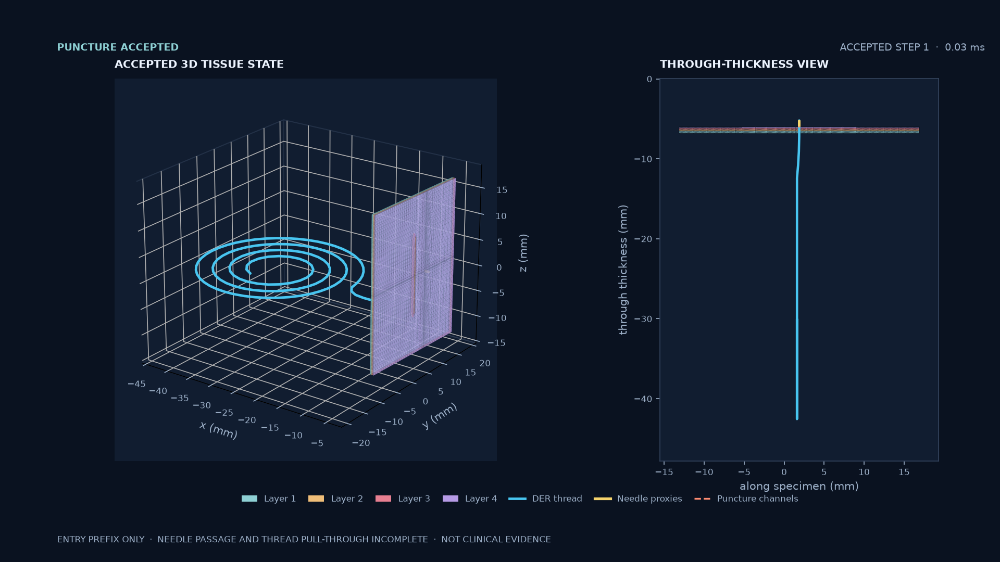

# Coupled Physics Solver

Apple-native coupled physics for articulated bodies, rigid contact,
heterogeneous Matter FEM/MPM, and discrete-elastic-rod sutures. The live step
runs through MetalWorld and lets Matter borrow the owning Metal command buffer;
there is no second simulation queue in the normal coupled path.

This is a focused extraction from Numi Lab. It contains the solver, material
compiler/runtime, surgical tissue and suture mechanics, and executable physics
probes. It does not contain training, MLX, rendering, app UI, or unrelated robot
products. See [PROVENANCE.md](PROVENANCE.md) for the exact source revision.

## Requirements

- Apple silicon Mac
- macOS with Xcode and the Metal 4 toolchain
- CMake 3.28 or newer

The first Metal 4 ownership path requires macOS 26 and Xcode 26. The existing
Matter/MetalWorld solver still uses the original Metal encoder API while its
dispatch graph is migrated; the Metal 4 contract probe is not evidence that
the complete solver has moved to that path.

## Build

```sh
cmake -S . -B build -DCMAKE_BUILD_TYPE=Release
cmake --build build --parallel
ctest --test-dir build --output-on-failure
```

The focused executables are written to `build/bin`:

- `coupled_matter_physics_probe`
- `coupled_surgical_tissue_probe`
- `coupled_suture_handoff_probe`
- `coupled_trial_check`
- `coupled_perfused_active_tissue_contract_probe`
- `coupled_perfused_active_tissue_probe`
- `coupled_metal4_execution_probe`

`coupled_trial_check MANIFEST.json` validates the versioned manifest, stream
shapes, normalized relative paths, byte counts, and SHA-256 payload identity.
Perfused-active material authoring has no numerical defaults: every geometry,
layer, perfusion, activation, damage, and contact scalar must carry bounded
evidence provenance before it can be configured.

The workspace command below runs exact replay and captures Metal evidence. GPU
counters are strict by default; use `--timeline-only` only when deliberately
recording timeline evidence without making counter claims.

```sh
numi coupled-profile --mode metal4
numi coupled-profile --mode tissue
numi coupled-profile --mode perfused
numi coupled-profile --mode coupled-perfused
numi coupled-profile --mode perfused-puncture
numi coupled-profile --mode perfused-pull-through
numi coupled-profile --mode heterogeneous
numi coupled-profile --mode heterogeneous-mixed
numi coupled-profile --mode heterogeneous-mutation
```

Heterogeneous FEM tetrahedra may own distinct passive constitutive materials
and densities while the object material owns external contact. Mixed-field
heterogeneous elements additionally own their transport, activation, fibre,
and active-stress coefficients. They must share the nodal pressure scale (bulk
modulus and thermal expansion). Heterogeneous mutable topology retains the
per-tetrahedron constitutive owner: splits copy the source owner, flips and
collapses cannot cross a material interface, and cross-material smoothing is
rejected transactionally. The focused heterogeneous-mutation probe executes a
two-material cylindrical puncture and gates active/eroded material counts plus
per-material density accounting. This does not yet qualify the full four-layer
surgical puncture sequence.

The perfused probe executes the four-layer path on Metal with synthetic,
provenance-shaped fixtures. It also gates every state-free layer's compiled
passive and mixed pressure/pore-pressure/active-fibre stress and mechanical
tangent against an independent FP64 scalar evaluator, with a separate FP64
directional-difference check. This is a constitutive-point parity boundary,
not a full-step FP64 oracle. The `coupled-perfused` mode connects that same
heterogeneous, active-field tissue directly to live DER strand contact through
the hard needle swage. The separate `perfused-puncture` mode admits a tapered
needle from positive clearance, creates and releases one mass-conserving
sub-element channel, and gates the active tetrahedron count of every layer
against its authored material ownership. The focused flat fixture uses a
synthetic 0.001 preactivation and disables same-object collision and cohesive
tearing while retaining external needle contact. These modes prove execution
and replay, not ex-vivo calibration or
indistinguishable visual/physical fidelity.

The `perfused-pull-through` mode extends that boundary into one continuous
curved-needle transaction: a synthetic interface cohesive strength admits the
first finite tract, the live tip advances a connected mass-conserving channel
through the four-layer wall, and the hard swage pulls the same device-resident
DER strand through it. Promotion requires exact per-layer topology identity,
zero removed tissue mass, bounded determinant/residual and perfused-field
state, resolved strand/channel contact, distal thread clearance, complete-state
replay hashes, and zero failed steps. Bulk cohesive-face tearing, local
layer-specific contact interfaces, post-admission fracture-energy expenditure,
and ex-vivo parameter calibration remain future boundaries rather than implied
capabilities.

Promotion remains gated by exact replay, FP64 parity, physical outcomes, zero
failed steps, and same-device Metal timeline/counter evidence. A successful
build or probe alone is not a physical-fidelity claim. The pull-through profile
also refuses a dirty worktree so its revision and runtime fingerprints identify
the exact source being promoted. Its Metal System Trace execution is replay B,
so the timeline is compared against the uninstrumented replay without adding a
redundant third full solver execution; a supported detailed-counter capture
remains a separate measurement. Before that long counter capture, the same
device runs a small Metal counter preflight; a null or failed headless counter
set is recorded as unsupported without launching another full tissue path.

## Latest medical deformable clip: suture entry prefix

[](docs/assets/perfused-suture-entry-prefix-20261004/perfused-suture-entry-prefix-20261004.mp4)

[Watch the clip](docs/assets/perfused-suture-entry-prefix-20261004/perfused-suture-entry-prefix-20261004.mp4). It shows two exact saved states: pre-entry and the first accepted puncture state on a synthetic four-layer coupon. The second state has one active channel and 5.783 µm maximum tissue-node displacement. The native curved-passage batch remained in flight until the bounded 5 min 50 s run was stopped; no completed needle passage or thread pull-through was captured. This is an incomplete software demonstration, not a wound-closure, calibration, or clinical result. The [source-bound run record](docs/assets/perfused-suture-entry-prefix-20261004/README.md) preserves the snapshots, binary/source hashes, and rendering code.

A related synthetic wound-lip traction run is also available as a [seven-state video](https://numi-lab-research.vercel.app/media/synthetic-skin-traction-trace-guided-20261004-7step.mp4). It reduced the mean gap by 11.26 µm over seven accepted 1 ms steps; the unchanged `1e-4` residual gate passed at `8.5955e-5`, while the stricter `5e-5` target was missed. Force reached only 0.253 mN per bite site of the planned 10 mN, so this is an incomplete, uncalibrated simulation prefix with no needle, thread, wound closure, or clinical result. The [Numi Lab medical preview](https://numi-lab-research.vercel.app/) includes both clips and their evidence limits.
