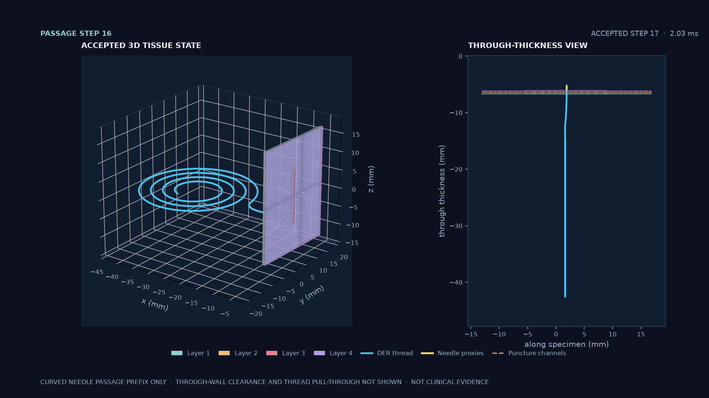

# Curved suture passage prefix — 2026-10-04

[Watch the six-state clip](perfused-suture-passage-prefix-20261004.mp4). It renders only saved accepted states at 1 fps; there is no interpolation. The poster shows the last accepted state, control step 17 at 2.03125 ms.

## Recorded result

- The synthetic four-layer coupon retained one active puncture channel in the accepted puncture and passage states. The run returned passage snapshots after each four-step device batch, through 16 curved-path microsteps.
- Comparing each state with pre-entry, the last accepted tissue mesh has 1.338 µm maximum node displacement and 0.044 µm RMS displacement. The puncture-accepted state peaked at 5.783 µm maximum displacement. The thread's maximum node displacement is 0.042981 mm at the final saved state; the needle proxy moved 0.040 mm from the puncture-accepted state.
- The four-step cadence made accepted passage prefixes inspectable. The previous 32-step batch remained in flight for more than seven minutes on an otherwise idle Mac mini and returned no passage snapshot. These runs do not establish a total-throughput improvement; per-step work and the physical tolerances were unchanged.
- The process was interrupted after the step-16 state was written, before through-wall clearance. There was no solver rejection, but also no distal exit, thread transport through the wall, suture retention, or wound closure. The needle was kinematically targeted; no Franka or dVRK arm was simulated.
- This is a synthetic software demonstration, not a measured tissue calibration or clinical result.

## Run and verification

The native probe ran on an Apple M4 Pro Mac mini (`Mac16,11`, 24 GB, macOS 26.6). The four-step version was built from the source tree bound in `artifacts/manifest.txt`; `artifacts/fingerprints.txt` records the probe, library, shader, and changed-source hashes. The exact batch-size/checkpoint diff and build log are retained under `artifacts/`.

The focused Metal CTests `coupled.suture.perfused_tissue_coupling` and `coupled.suture.perfused_tissue_puncture` passed 2/2 in 24.25 seconds. The stopped run's stdout contains only the authored-reset line because its progress stream was buffered; the six native TSV snapshots are the accepted-state evidence. `analyze_prefix.py` recomputes the displacement summaries from those files, and `fingerprints.txt` binds every input and generated media file.

The source change reduces `kCurvedPassageChunkSteps` to four and saves a visualization snapshot at every completed chunk. It does not change tissue material, needle targets, time step, nonlinear acceptance thresholds, or contact settings. The rendered footer explicitly marks this as a curved-passage prefix with through-wall clearance and thread pull-through unresolved.
